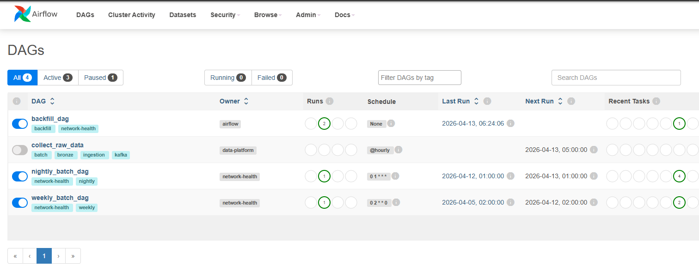
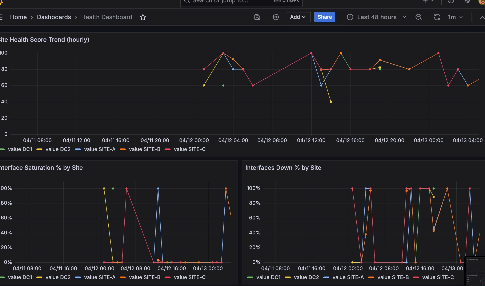
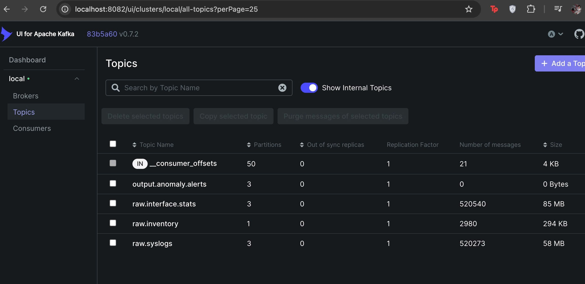
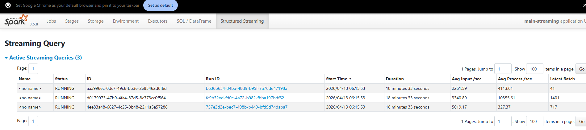
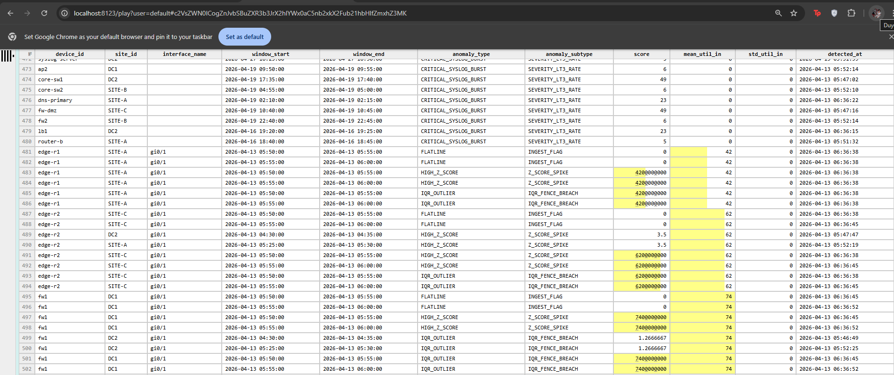
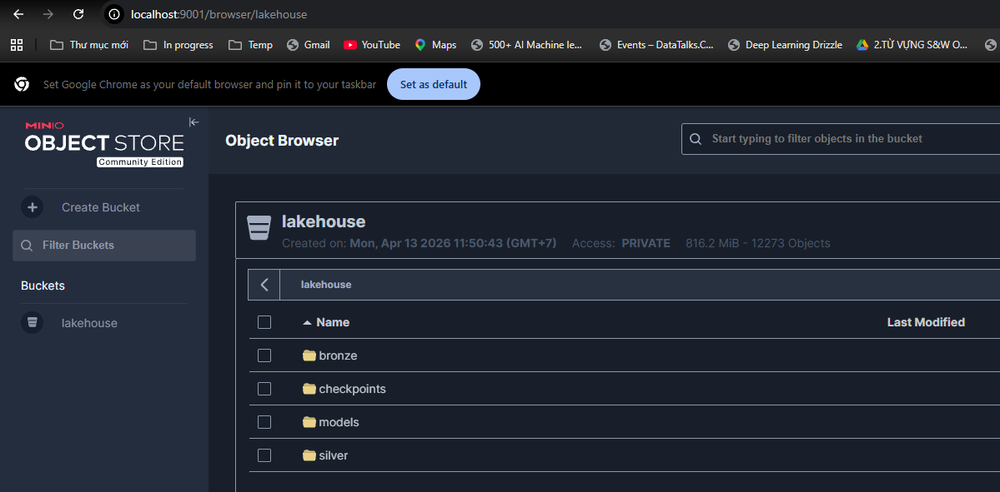
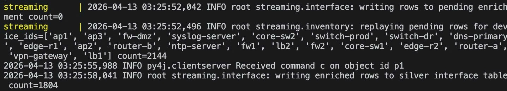

# ADR: Network Health Platform — PoC

> Architecture Decision Record for the Data Engineer Technical Assessment (April 2026).
> Explains approach, scale considerations, and trade-offs as actually implemented.

---

## System Screenshots

### Airflow — DAG overview
http://localhost:8085       (admin/admin)


### Grafana — Health Dashboard
http://localhost:3000       (admin/admin)


### Kafka UI
http://localhost:8082


### Spark UI
http://localhost:8080 (for batch jobs) or http://localhost:4040 (for streaming jobs)




### ClickHouse


### MinIO — Lakehouse Bucket
http://localhost:9001 (minioadmin/ minioadmin123)


---

## Context

A Network Management Platform monitors critical on-premises infrastructure.
The current "poll-and-store" model cannot keep up with volume growth or provide
sub-hour observability. This PoC proves that an open-source, fully air-gapped
Lakehouse architecture can replace it.

**Inputs (PoC batch; production streams):**
- `device_inventory.csv` — static device registry
- `interface_stats.csv` — per-interface utilisation telemetry
- `syslogs.jsonl` — device syslog events

**Hard constraints:** no internet, no proprietary services, on-premises only.

---

## Architecture at a Glance

```
CSV / JSONL files
      │
      ▼
 Kafka (3 input topics · 1 alert output topic)
      │
      ├── Spark Structured Streaming ──► Iceberg bronze  (raw, immutable, always-on)
      │        (bronze-ingest, slow 1-min trigger)
      │
      └── Spark Structured Streaming ──► Iceberg silver  (validated, enriched, scored)
               (main pipeline, 30-sec trigger)            │
               1. Validate + DLQ invalid records          │
               2. Enrich with inventory / park pending    │
               3. Apply baseline-driven z-score/IQR       │
                                                          ▼
                                           ClickHouse (OLAP — materialized views)
                                     ┌─────────────────────────────┐
                                     │ Silver Iceberg views        │
                                     │ (Refresh from MinIO)         │
                                     └──────────────┬──────────────┘
                                                    │
                     ┌──────────────────────────────┼──────────────────────────────┐
                     ▼                              ▼                              ▼
             device_baseline_params       mv_anomaly_summary        gold_site_health_hourly
             (2 weekly sources:            (1-min refresh)           (SummingMergeTree)
              isolation_forest_train       Deduplicates & promotes   Aggregates via
              psi_drift_detect)            anomalies to              mv_site_health_hourly
                                           gold_anomaly_flags
                                          (5-min windows)
                                                    │
                                                    ▼
                                            gold_anomaly_flags
                                           (ReplacingMergeTree)
                                                    │
                                                    ▼
                                          Grafana dashboards

AIRFLOW-ORCHESTRATED BATCH JOBS
  nightly_batch_dag  (01:00 daily):
    dlq_reprocess → pending_enrichment → model_detect (Isolation Forest)
  weekly_batch_dag   (02:00 Sunday):
    isolation_forest_train → psi_drift_detect
  backfill_dag       (manual):
    backfill (bronze → silver, full SparkSQL window path)
```

---

## Data Architecture: ClickHouse Tables & Views

**Silver layer** (Iceberg tables, read via ClickHouse native Iceberg engine):
- `silver_interface_stats_src` — per-record ingest_z_score, ingest_iqr_score, ingest_anomaly, ingest_flags (includes FLATLINE, HIGH_Z_SCORE, IQR_OUTLIER, THRESHOLD_SATURATED)
- `silver_syslogs_src` — critical syslog events
- `silver_flatline_anomaly_flags` — legacy staging table; no longer written by active jobs (FLATLINE now detected inline and written to silver interface stats `ingest_flags`)

**Baselines** — `device_baseline_params` (ReplacingMergeTree, valid_from ordered):
- Written by 2 weekly sources (source tracked in distilled_rules JSON):
  - `isolation_forest_train.py` — 30-day statistical baseline (z-score bounds)
  - `psi_drift_detect.py` — drift-corrected baseline if PSI > 0.25
- Consumed by: `streaming.py` (TTL 30 min refresh), `batch.py` (loaded at job start)
- Note: `mv_device_baseline_refresh` was removed — it overwrote seeded baselines with computed zeros for test devices

**Materialized Views** (refresh every 1 minute, append-only to gold):
- `mv_anomaly_summary` — deduplicates & promotes silver ingest flags to `gold_anomaly_flags` (5-min windows, ≥3 violations)
- `mv_site_health_hourly` — aggregates interface stats per site to `gold_site_health_hourly`

**Gold layer** (monitored by Grafana dashboards):
- `gold_anomaly_flags` (ReplacingMergeTree) — anomalies deduplicated by (device, interface, type, subtype, window_start); consumed by anomaly dashboard
- `gold_site_health_hourly` (SummingMergeTree) — site hourly health scores (0-100), pct_interfaces_saturated, pct_down, critical_syslog_count; consumed by health & anomaly dashboards

---

**Technology choices:**

| Component | Technology | Rationale |
|-----------|-----------|-----------|
| Message bus | Apache Kafka | Decouples producers from consumers; enables replay; compacted topic for inventory gives CRDT-like upsert semantics; keyed by `device_id` preserves per-device ordering for stateful detection |
| Open table format | Apache Iceberg | ACID writes, time-travel, partition evolution, schema evolution — REST Catalog is engine-agnostic; ClickHouse, Spark, Trino all connect via the same API |
| Object store | MinIO | S3-compatible drop-in. Single-node for PoC; scales to multi-drive or Ceph for production without client changes |
| Batch + stream compute | PySpark 3.5 | Single engine for both streaming (Structured Streaming) and batch (DataFrame API). Spark is explicitly required in Challenge 1 |
| OLAP query layer | ClickHouse | Sub-second aggregation queries. `ReplacingMergeTree` gives upsert semantics for gold tables. Refreshable Materialized Views push aggregation to near-real-time without a separate Spark job. Native Iceberg table engine reads silver directly |
| Orchestration | Apache Airflow | DAG-level dependency, retry, and alerting for all batch jobs. Structured Streaming jobs run as always-on containers managed by Docker Compose |
| Ad-hoc queries | DuckDB | Zero-infra; reads Iceberg directly via S3; exposed via FastAPI as a Grafana JSON datasource |

---

## Decision 1 — Medallion Lakehouse over a Single Database

**Problem:** A single write-optimised database cannot simultaneously serve raw
replay, mid-latency enrichment, and sub-second dashboard queries.

**Decision:** Three layers with explicit contracts:

| Layer | Store | Guarantee | Use case |
|-------|-------|-----------|----------|
| **Bronze** | Iceberg (MinIO) | Append-only, immutable raw payload | Replay, audit, schema debugging |
| **Silver** | Iceberg (MinIO) | Validated, enriched, anomaly-scored, partitioned | Reprocessing, Spark batch reads, ClickHouse Iceberg engine reads |
| **Gold** | ClickHouse | Aggregated, deduplicated | Dashboards, alerts, API queries |

Bronze stores the raw JSON `_raw_payload` alongside parsed fields. Any schema
change or re-scoring logic can be applied retroactively by replaying bronze
through updated silver transforms — no re-ingestion from Kafka required.

**Why REST Catalog over Hive Metastore:**
Engine-agnostic: Spark, DuckDB, Trino, and ClickHouse all connect via the same
REST API. No Thrift server dependency. Simpler Docker Compose setup. In
production, swap to Apache Polaris (full) or AWS Glue without any client-side
changes — only the catalog `uri` config changes.

---

## Decision 2 — Streaming-First Ingestion with Batch Safety Net

**Why streaming-first?**
The production framing describes high-velocity streams. A batch-only design
delays anomaly detection by up to an hour. Spark Structured Streaming with
30-second micro-batch intervals brings detection latency to under two minutes for
ingest-time checks and under four hours for sliding-window flatline detection.

**Why a batch safety net?**
Streaming jobs can lag or fail. The `nightly_batch_dag` runs four sequential
tasks that recover anything missed:

**Handle Orphaned Records By Parking for Late Enrichment**

I don't immediately route orphaned records to DLQ, because they may be enriched later when the inventory record arrives. Instead, I park them in `silver.pending_enrichment` and trigger a replay for that `device_id` when a new inventory record arrives. This gives late-arriving inventory a chance to enrich prior orphaned records without waiting for the nightly batch job.

1. `dlq_reprocess` — promotes quarantined records whose `device_id` has since
   appeared in inventory; marks permanent failures.
2. `pending_enrichment` — enriches records parked in `silver.pending_enrichment`
   once a matching inventory row arrives; increments `retry_count` on each
   failed attempt.
3. `model_detect` (batch) — applies the trained Isolation Forest model to
   yesterday's silver data for records the streaming scorer did not flag.

**Batch anomaly scoring (`batch.py`):**
The backfill job loads baseline params from ClickHouse at job start and calls
`apply_ingest_scores()` — the same function used by streaming — so backfilled
silver rows carry accurate ingest_z_score, ingest_iqr_score, and ingest_flags.
Falls back to an empty baseline (only THRESHOLD_SATURATED can fire) if
ClickHouse is unreachable.

**Pending enrichment — event-driven first:**
When a new inventory record arrives, the streaming job automatically re-processes
`silver.pending_enrichment` records for that `device_id` (without waiting for
nightly batch). Parsing and baseline-scoring are redone to ensure late-enriched
records have accurate ingest_* annotations. The Airflow nightly `pending_enrichment`
task is a safety net for records that missed the event-driven replay.

---

## Decision 3 — Defensive Ingestion via ValidatorChain + DLQ

Every record passes through a `ValidatorChain` before reaching the silver layer.
Validators are implemented as native Spark column expressions — no UDFs — so
they run at full partition-level parallelism.

**ValidatorChain:**

```
NullCheck      → required fields (ts, device_id, interface_name, util_in/out, oper_status)
TimestampCheck → ts must parse ISO8601; |ts − ingested_ts| < 24h
RangeCheck     → util_in/out ∈ [0, 100]; severity ∈ [0, 7]
StatusCheck    → admin_status ∈ {1,2}; oper_status ∈ {1,2,3}
OrphanCheck    → device_id must exist in bronze.inventory snapshot
```

Chain stops on first failure and routes to DLQ with the reason code.

**DLQ validation codes** (streaming pipeline):

| Reason code | Cause |
|-------------|-------|
| `NULL_FIELD` | Required field missing |
| `NEGATIVE_UTIL` | Utilization < 0% |
| `EXCEEDS_MAX` | Utilization > 100% |
| `INVALID_STATUS` | oper_status ∉ {1,2,3} |
| `INVALID_TIMESTAMP` | Timestamp parsing failed |
| `INVALID_SEVERITY` | Severity < 0 or > 7 |

**DLQ disposition** (nightly batch via dlq_reprocessor.py):
- Records with matching device_id in inventory: promoted to silver (device now known)
- Records with no matching device_id: marked PERMANENT (device unknown and unreachable)
- All raw payloads preserved in Iceberg for audit trail and future reprocessing

The raw JSON `raw_payload` is always preserved in the DLQ table and never mutated.
The DLQ is an Iceberg table itself — it supports time-travel and can be queried
retroactively. All updates via Iceberg `MERGE INTO` are atomic and idempotent.

**Metrics:** `dlq_records_total[topic, reason]` counter per rejection.
AlertManager fires a `WARNING` if DLQ rate exceeds 5 % of ingested volume for
more than two minutes.


---

## Decision 4 — Business Logic: Effective Utilisation and Health Score

### Effective Utilisation

```python
# src/transforms/effective_util.py — native Spark column expression, no UDF
effective_util_in  = when(oper_status.isin(2, 3), 0.0).otherwise(util_in)
effective_util_out = when(oper_status.isin(2, 3), 0.0).otherwise(util_out)
```

Applied identically at streaming ingestion time and during batch backfill so the
rule is enforced consistently. Raw values (`util_in`, `util_out`) are preserved
in silver for audit.

### Site Health Score (hourly, per site)

```
health_score = 100
    − (pct_interfaces_saturated × 40)        # saturation penalty, max 40 pts
    − (min(critical_syslog_count, 4) × 10)   # syslog penalty, max 40 pts (capped)
    − (pct_interfaces_down × 20)             # availability penalty, max 20 pts

Clamped to [0, 100].  is_degraded = (score < 40)
```

**Definitions:**
- `pct_interfaces_saturated`: fraction of readings where `effective_util_in > 80` or `effective_util_out > 80` in the hour window
- `critical_syslog_count`: count of syslogs with `severity < 3` (EMERGENCY=0, ALERT=1, CRITICAL=2) in the hour window; capped at 4 to prevent one noisy device from dominating the score
- `pct_interfaces_down`: fraction of readings where `oper_status ≠ 1`; lower weight (20) because `effective_util` already zeroes out DOWN interfaces, avoiding double-penalisation

**How it is computed:**
ClickHouse `mv_site_health_hourly` (Refreshable MV, 1-minute refresh, APPEND
mode) reads `silver_interface_stats_src` (Iceberg table engine pointing at MinIO)
and emits rows into `gold_site_health_hourly` (SummingMergeTree). Adding a new
gold metric requires only a new MV SQL file — zero Spark changes, zero restarts.

---

## Decision 5 — Schema Evolution via `_extra_cols`

**Problem:** `interface_stats.csv` may add a `packet_loss` column without notice.
Hard-coded Spark schemas would throw `AnalysisException` and halt ingestion.

**Three-layer defence:**

**Layer 1 — Consumer (read time):**
`CsvConsumer` validates only `REQUIRED_COLUMNS`. Extra columns read into a dict
(`model.model_extra` via Pydantic `extra="allow"`). No `KeyError` on unknown
fields.

**Layer 2 — Spark (parse time):**
`from_json` with `PERMISSIVE` mode. Known columns parsed with strict schema.
All fields parsed as a flat `map<string, string>` → unknown keys filtered out →
stored as `_extra_cols` column:

```python
extra = map_filter(from_json(raw, MapType(StringType(), StringType())),
                   lambda k, v: ~k.isin(KNOWN_COLUMNS))
```

**Layer 3 — Iceberg (write time):**
Table property `write.spark.accept-any-schema = true` on silver tables.
When `packet_loss` is formally promoted to a first-class column, Iceberg
auto-adds it to the schema and backfills `NULL` for all prior records — no
pipeline downtime, no manual DDL.

**End result:** A `packet_loss` column arriving next week flows from source
through consumer, Spark, and Iceberg with zero engineer intervention. It lands
in `_extra_cols` immediately and is queryable via `_extra_cols['packet_loss']`
before any schema promotion.

---

## Challenge 1 — Migration Architect (50 GB/day)

### Partitioning Strategy

At 50 GB/day, the dominant query pattern is:
```sql
WHERE site_id = 'SITE-A' AND device_ts BETWEEN '2026-04-01' AND '2026-04-07'
```

`silver.interface_stats` is partitioned with:
```
PARTITIONED BY (identity(site_id), days(_partition_date))
SORTED BY (device_id, interface_name, device_ts)
```

- **`identity(site_id)`** eliminates cross-site data scanning. A query for one
  site reads only its files — I/O reduced by a factor of `number_of_sites`.
- **`days(_partition_date)`** prunes day-granularity time ranges — further
  reduces to `days_in_range / total_days` of site files.
- **Sort order** within each partition file lets Iceberg column statistics
  (min/max per row group) skip Parquet row groups that don't match predicate.

At 50 GB/day across ~50 sites → ~1 GB per site-day partition → one Parquet
file per partition per micro-batch, well above the small-file threshold.

**Kafka partition design:**
`raw.interface.stats` uses 6 partitions keyed by `device_id`. All messages for a
device land on the same Kafka partition, preserving per-device temporal order for
the IQR rolling window and Welford variance computations.

### SparkSQL Window Function Aggregation (Code Bonus)

The backfill job ([src/pipeline/batch.py](src/pipeline/batch.py)) implements the full bronze → silver
transformation via the Spark DataFrame API with `identity(site_id)` + date
partition pruning:

```python
bronze_stats = (
    spark.table("rest.bronze.interface_stats")
    .withColumn("device_ts", F.to_timestamp("ts"))
    .withColumn("effective_util_in",
        F.when(F.col("oper_status").isin(2, 3), 0.0)
         .otherwise(F.col("util_in")))
    .withColumn("effective_util_out",
        F.when(F.col("oper_status").isin(2, 3), 0.0)
         .otherwise(F.col("util_out")))
)
silver = bronze_stats.join(inventory, on="device_id", how="left") \
    .withColumn("_partition_date", F.to_date("device_ts"))
```

The gold recompute job ([src/pipeline/gold_recompute.py](src/pipeline/gold_recompute.py)) uses SparkSQL tumbling
windows to produce hourly site health scores:

```python
hourly = (
    silver.groupBy(
        F.col("site_id"),
        F.window("device_ts", "1 hour").alias("w"),
    )
    .agg(
        F.avg("effective_util_in").alias("avg_util_in"),
        F.avg(F.when(F.col("effective_util_in") > 80, 1.0)
               .otherwise(0.0)).alias("pct_saturated"),
        F.avg(F.when(F.col("oper_status") != 1, 1.0)
               .otherwise(0.0)).alias("pct_down"),
    )
    .withColumn("health_score",
        F.greatest(F.lit(0.0),
            F.lit(100.0)
            - F.col("pct_saturated") * 40.0
            - F.col("pct_down") * 20.0))
)
```

### Scale Trade-offs

| Decision | Trade-off |
|----------|-----------|
| Single Spark master/worker in PoC | Swap to Kubernetes operator or YARN for production — only `spark.master` changes |
| Snappy compression | Faster write/read at slightly larger file size; switch to Zstd for storage-constrained deployments |
| `identity(site_id)` partition | Assumes bounded, low-cardinality site list. For high-cardinality tenants use bucket partitioning instead |
| 30-second micro-batch | Balances latency vs Iceberg commit overhead. At 50 GB/day (~580 KB/s) → ~17 MB Parquet file per micro-batch |
| ClickHouse MV for gold refresh | 1-minute MV refresh cadence avoids running a dedicated Spark gold job every minute, keeping the compute surface small |

---

## Challenge 2 — AI & Real-Time: Anomaly Detection Architecture

### Anomaly Detection Strategy

**Three tiers by latency:**

| Layer | Method | Latency |
|-------|--------|---------|
| **Ingest-time** | Threshold (util > 80%) + Z-score/IQR + Flatline (Welford) | ~30s |
| **Weekly batch** | Isolation Forest (10-feature multivariate) | ~1 day |
| **Weekly validation** | PSI drift detection | ~1 day |

**Ingest-time scoring** (streaming.py):
- Baselines from ClickHouse `device_baseline_params` table
- Z-score: `|util − mean| / (std + ε) > 2.0` → `HIGH_Z_SCORE`
- IQR: `|util − mean| / (iqr_k × std + ε) > 1.0` → `IQR_OUTLIER`
- Flatline: Welford online variance over all UP-interface rows in the micro-batch → `FLATLINE`
- Refreshed every 30 minutes from ClickHouse

**Dual baseline sources** (both write to `device_baseline_params`, tracked via distilled_rules.source):

1. **Isolation Forest** (`isolation_forest_train.py` — weekly batch):
   - Trains on 30 days confirmed-normal data (ingest_anomaly=false)
   - Creates baseline_mean, baseline_std per (device, interface, hour, day)
   - Distills sklearn model → lightweight JSON DecisionTree rules
   - Writes 42,408 entries (280 device/interface × 24h × 7 days)
   - Source: "isolation_forest"

2. **PSI Drift Detector** (`psi_drift_detect.py` — weekly batch, runs AFTER IF):
   - Compares last 7 days vs previous 23 days for distribution shift detection
   - If PSI > 0.25: overwrites IF baseline_mean/baseline_std to current window
   - Detects capacity upgrades, traffic changes, firmware updates, seasonal shifts
   - Source: "psi_drift_detector"

**Why dual sources (not three):**
- ReplacingMergeTree (valid_from versioned) picks latest baseline automatically
- IF provides statistically trained baseline; PSI ensures it adapts to real-world changes
- Source field in distilled_rules enables audit trail and debugging
- `mv_device_baseline_refresh` (formerly a third source) was dropped: it computed
  `avg(effective_util_in)` from all silver data including anomalous periods, resulting
  in zero-mean baselines for test devices where seeded values were the only truth signal.
  Removing it prevents the MV from overwriting carefully seeded or IF-trained baselines.

### Anomaly Detection Split: Ingest-time vs Batch

**Current implementation (ingest-time):**
Streaming pipeline runs per-record scoring inside each `foreachBatch` callback:
- Threshold alerting (util > 80%) → `THRESHOLD_SATURATED`
- Z-score / IQR scoring (stateless, baseline-driven) → `HIGH_Z_SCORE`, `IQR_OUTLIER`
- Welford variance flatline detection (driver-side, per micro-batch) → `FLATLINE`

All four flag types are written as `ingest_flags` array entries on each silver
interface stats row. `mv_anomaly_summary` ARRAY JOINs `ingest_flags` and promotes
to `gold_anomaly_flags` with a ≥3 violation debounce (5-min windows).

### Why Isolation Forest runs in batch, not streaming

Running a batch-trained sklearn model inline in every Spark micro-batch would:

- Introduce multi-second cold-start latency on every model reload.
- Create driver ↔ executor serialisation overhead for the sklearn objects.
- Make the streaming job stateful in a way Spark checkpoints cannot capture.

The right split: **stateless per-record checks (Z-score, IQR, threshold) and
lightweight variance checks (Welford flatline) in streaming; the heavier
multivariate model in nightly batch** where the latency budget is hours, not seconds.

### Why online learning (Half-Space Trees, RRCF) was rejected

Online models consume each incoming record as a training update. In
infrastructure monitoring, anomalous records — flatlines, spikes, DoS traffic
— would be absorbed and the model would drift toward treating failures as
normal. The worse the network gets, the blinder the detector becomes. This is
**concept contamination**, not concept drift. Without labels, online learning
cannot distinguish between the two. The decision mirrors production practice at
Cloudflare, Netflix, and Datadog: controlled periodic retraining on a
validated-normal corpus.

### Flatline Detection (Active — Welford Inline)

Flatline detection is **active** and runs inside each `foreachBatch` callback of
`streaming.py` without a separate Spark job or JVM process. The approach uses the
Welford online variance algorithm from [src/transforms/flatline_v2.py](src/transforms/flatline_v2.py).

**Why not a separate Spark job with 4-hour tumbling windows:**
- Tumbling-window append mode only emits after watermark passes the window end
  (08:00+ for a 4-hour window), so short test bursts (4 minutes) never emit.
- Running two Spark JVMs on a laptop caused JVM SIGSEGV (G1GC OOM crashes).
- The approach is over-engineered for the PoC scale.

**Active implementation** ([src/pipeline/streaming.py](src/pipeline/streaming.py)):

```python
# Driver-side, per micro-batch — no UDF, no second Spark job
def _get_flatline_keys(enriched_df):
    rows = enriched_df.filter(col("oper_status") == 1)
                      .select("device_id", "interface_name", "effective_util_in")
                      .collect()
    # Group by (device_id, interface_name), run Welford variance on values
    # Returns set of (device_id, interface_name) pairs where variance < eps
    ...

def _apply_flatline_flags(enriched_df, flatline_keys):
    # Broadcast-join flatline keys back to mark each matching row:
    #   ingest_flags = array_union(ingest_flags, ["FLATLINE"])
    #   ingest_anomaly = True
    ...
```

Both the normal enrichment path (`_process_interface_batch`) and the inventory
replay path (`_replay_pending_from_inventory`) call these functions so flatline
detection applies regardless of whether inventory was cached at arrival time.

**Configuration** (environment variables):
- `FLATLINE_VARIANCE_THRESHOLD` (default: `0.01`) — max variance to classify as flatline
- `FLATLINE_MIN_POINTS` (default: `30`) — minimum samples per (device, interface) group

**Gold flow:** FLATLINE in `ingest_flags` → `mv_anomaly_summary` ARRAY JOIN →
`gold_anomaly_flags` (same debounce path as HIGH_Z_SCORE / IQR_OUTLIER).

**Legacy path:** `silver_flatline_anomaly_flags` still participates in the
`mv_anomaly_summary` UNION ALL (for backward compatibility) but is no longer
written by any active job. The `flatline-streaming` Docker Compose service is
commented out.

---

## Model Feedback Loop and Retraining Discipline

**Weekly cycle:**
1. Streaming writes `ingest_z_score`, `ingest_iqr_score`, `ingest_flags` per record
2. Isolation Forest trains on confirmed-normal silver rows (ingest_anomaly=false)
3. Creates baselines → syncs to ClickHouse
4. PSI Drift Detector validates baselines, updates if PSI > 0.25
5. Streaming next micro-batch reloads baselines (TTL 30 min)
6. Self-correcting loop closes — no manual redeploys needed

**Training corpus:** Always on confirmed-normal data (ingest_anomaly=false) to prevent model drift toward treating failures as normal. Source tracking in ClickHouse shows which algorithm produced each baseline (isolation_forest vs psi_drift_detector).

**Why train only on confirmed-normal data:**
Training on all data silently includes degraded periods, causing the model to learn that failures are normal. By excluding both ingest-time anomalies and prior batch flags, the training corpus stays clean regardless of how degraded the network becomes.

**Model promotion safeguards:**
Before a newly trained Isolation Forest replaces the production model:

1. Candidate is scored on a held-out validation window (most recent 7 days of
   confirmed-normal silver).
2. Precision and recall computed against the current model on the same window.
3. Candidate promoted **only if it matches or improves both metrics**.
4. If it underperforms: current model retained, `model_retrain_rejected_total`
   Prometheus counter incremented, AlertManager fires for engineer review.
5. PSI > 0.25 (genuine concept drift — device replacement, firmware update)
   requires human sign-off before the new distribution is accepted as baseline.
6. Every promotion decision is logged to MinIO (version-pinned by Airflow `run_id`)
   for full audit trail.

---

## Observability

Three pillars run fully on-premises:

**Prometheus metrics ([src/monitoring/metrics.py](src/monitoring/metrics.py)):**

```
records_ingested_total{source, topic}      Counter
records_validated_total{result}            Counter    # result: clean | dlq
dlq_records_total{reason}                  Counter
kafka_consumer_lag{topic, partition}       Gauge
flatline_events_total{site_id}             Counter
model_anomaly_flags_total{subtype}         Counter
model_retrain_promoted_total               Counter
model_retrain_rejected_total               Counter    # candidate underperformed
pipeline_latency_seconds{stage}            Histogram
site_health_score{site_id}                 Gauge      # latest score
```

**AlertManager rules:**

| Alert | Threshold | Severity |
|-------|-----------|----------|
| HighDLQRate | rate(dlq) / rate(total) > 5 % for 2 min | warning |
| NoPipelineIngestion | rate(records_ingested) == 0 for 5 min | critical |
| KafkaConsumerLagHigh | lag > 10,000 | warning |
| FlatlineDetected | flatline_events increase > 0 | critical |
| SiteHealthDegraded | health_score < 40 for 5 min | warning |
| ModelRetrainingRejected | model_retrain_rejected increase > 0 in 1h | warning |

**Grafana dashboards** (query ClickHouse gold tables):
1. `pipeline.json` — Kafka lag, throughput, DLQ breakdown, latency per stage
2. `data_quality.json` — quarantine reasons, false-positive rate, reprocessing success
3. `anomaly.json` — anomalies per site from `gold_anomaly_flags`, health scores per site from `gold_site_health_hourly`
4. `health.json` — site hourly health scores from `gold_site_health_hourly` (SummingMergeTree), trends & degradation alerts

---

## Validation Script Result: [scripts/validate_pipeline.sh](scripts/validate_pipeline.sh)
```
{13:18}~/ST-Assignment:feature/add-anomaly-dection ✗ ➭ ./scripts/validate_pipeline.sh
╔════════════════════════════════════════════════════════════════╗
║          Network Health Pipeline Validation Script             ║
╚════════════════════════════════════════════════════════════════╝

═══════════════════════════════════════════════════════════════════
 PHASE 1: Services Running
═══════════════════════════════════════════════════════════════════
✓ zookeeper is running
✓ kafka is running
✓ minio is running
✓ iceberg-rest is running
✓ spark-master is running
✓ spark-worker is running
✓ clickhouse is running
✓ producer-interface is running
✓ producer-syslogs is running
✓ producer-inventory is running
✓ bronze-ingest is running
✓ streaming is running
✓ query-api is running

═══════════════════════════════════════════════════════════════════
 PHASE 2: Bronze Layer (Iceberg) — row counts
═══════════════════════════════════════════════════════════════════
✓ Iceberg REST catalog reachable
✓ bronze.syslogs: 124650 rows
✓ bronze.interface_stats: 122020 rows
✓ bronze.inventory: 700 rows

ℹ Total bronze rows across all tables: 247370

═══════════════════════════════════════════════════════════════════
 PHASE 3: Silver Layer (ClickHouse mirrors & staging)
═══════════════════════════════════════════════════════════════════
✓ silver.silver_interface_stats_src: 772010 rows
✓ silver.silver_syslogs_src: 100690 rows
⚠ silver.silver_flatline_anomaly_flags: 0 rows (streaming job may not have caught up)

DLQ quarantine status:
✓ DLQ is clean: 0 quarantined

═══════════════════════════════════════════════════════════════════
 PHASE 5: Baselines & Materialized Views
═══════════════════════════════════════════════════════════════════
Device baseline parameters (ReplacingMergeTree):
✓ device_baseline_params: 17649 rows
ℹ   Sources: ,

Materialized Views (refreshed every 1 minute):
✓ MV mv_anomaly_summary exists
✓ MV mv_site_health_hourly exists

═══════════════════════════════════════════════════════════════════
 PHASE 6: Gold Layer (ClickHouse)
═══════════════════════════════════════════════════════════════════
✓ gold.gold_site_health_hourly: 8507 rows
✓ gold.gold_anomaly_flags: 1018 rows

Gold layer aggregation quality:
ℹ Site health aggregations:
ℹ   DC1: records=1876 min=20 max=100 avg=81.96
ℹ   DC2: records=1824 min=20 max=100 avg=80.94
ℹ   SITE-A: records=2148 min=20 max=100 avg=81.07
ℹ   SITE-B: records=1599 min=20 max=100 avg=80.18
ℹ   SITE-C: records=1060 min=20 max=100 avg=82.24

═══════════════════════════════════════════════════════════════════
 PHASE 7: Prometheus Metrics (Pipeline Observability)
═══════════════════════════════════════════════════════════════════
✓ Prometheus reachable at http://localhost:9090

Ingest pipeline metrics:
⚠   ingest_records_total: 0 (no ingest yet)
✓   dlq_records_total: 0 (no rejections)

Anomaly detection metrics:
⚠   anomalies_total: 0 (no anomalies detected yet)
ℹ   latest_site_health_score: no data

Pipeline latency metrics:
⚠   stream_batch_duration_seconds: no histogram data yet

═══════════════════════════════════════════════════════════════════
 PHASE 8: Anomaly Detection
═══════════════════════════════════════════════════════════════════
Anomaly type counts on gold_anomaly_flags FINAL:
⚠   THRESHOLD_SATURATED: 0
✓   HIGH_Z_SCORE: 8
✓   IQR_OUTLIER: 8
✓   FLATLINE: 6
✓   CRITICAL_SYSLOG_BURST: 568
⚠   MODEL: 0
ℹ   total gold anomaly records: 590

Site degradation alerts (health_score < 40):
⚠   Degraded sites detected:
⚠     DC2: 3 windows, min=20 avg=20
⚠     SITE-B: 20 windows, min=20 avg=20
⚠     DC1: 17 windows, min=20 avg=20.1
⚠     SITE-C: 3 windows, min=20 avg=20
⚠     SITE-A: 15 windows, min=20 avg=23.4
```

## Production Upgrade Path

| PoC component | Production swap-in | Effort |
|---------------|-------------------|--------|
| CsvConsumer / JsonlConsumer | MqttConsumer / API poller | One class per source, same `BaseProducer` ABC |
| Spark Structured Streaming | Apache Flink | If sub-second latency required; Silver Iceberg schema unchanged — only compute engine changes |
| Iceberg REST Catalog + PostgreSQL | Apache Polaris (full) or Project Nessie | Same REST API; change catalog `uri` in config |
| MinIO | On-prem Ceph or NetApp S3-compatible | Change endpoint + credentials in `.env` |
| IsolationForest (joblib) | ONNX model served inline | Swap `AnomalyDetector` implementation; interface unchanged; removes sklearn dependency from workers |
| FlatlineDetector (Welford) | ONNX / River streaming ML | Same `AnomalyDetector` interface |
| ClickHouse `device_baseline_params` | ScyllaDB feature store | Sub-millisecond latency for high-frequency embedding lookups at extreme device scale |
| ClickHouse single node | ClickHouse Keeper-backed cluster | `ReplicatedReplacingMergeTree`; identical SQL |
| Docker Compose | Kubernetes + Helm | Same images; operator-managed autoscaling |
| `.env` credentials | HashiCorp Vault + mTLS | Zero application code changes; secrets injected as env at container start |
| JSON-over-Kafka (no schema registry) | Confluent Schema Registry OSS (Avro) | Enforces schema at produce time; catches producer drift before it reaches bronze |
| MinIO model artefact path | MLflow Model Registry | Version-pinned `production` / `staging` stage tags; MinIO path becomes the artefact store backend |

---

## Summary of Decisions

1. **Kafka as the integration bus** keeps producers (CSV/JSONL generators) and
   consumers (Spark, Airflow batch) fully decoupled and enables full replay.
   Keying by `device_id` preserves per-device ordering for stateful computations.

2. **Iceberg medallion (bronze → silver → gold)** separates raw durability from
   enriched data from query-optimised aggregates, without duplicating the compute
   pipeline. REST Catalog makes the storage layer engine-agnostic.

3. **`identity(site_id) + days(_partition_date)` partitioning** on silver is the
   single most important structural decision for query performance at 50 GB/day.
   Within-file sort order adds a third level of pruning.

4. **DLQ as an Iceberg table with `raw_payload`** makes every rejection auditable,
   replayable, and promotable — zero data loss. Nightly `dlq_reprocessor` promotes
   records whose device_id now exists in inventory; marks others PERMANENT.

5. **`_extra_cols map<string, string>` + Iceberg `accept-any-schema`** gives
   schema evolution for free: unknown columns are captured, preserved, and
   formally promotable without pipeline downtime.

6. **Layered anomaly detection (threshold → Z-score/IQR → Welford flatline → Isolation
   Forest)** places each check at the right point in the latency/complexity trade-off.
   All four ingest-time checks run inline in `foreachBatch` (~30 s latency) without a
   second Spark JVM. Online learning was explicitly rejected to avoid concept
   contamination.

7. **Isolation Forest baseline initialization** trains weekly on 30 days of
   confirmed-normal data, creating statistical baselines for each device/interface
   /hour/day combo. Distilled decision trees export rules to streaming as JSON
   without model serialization overhead.

8. **PSI Drift Detector validation** runs weekly after Isolation Forest to detect
   distribution shifts (PSI > 0.25). When significant drift is detected, baselines
   are updated to the current window. This prevents baselines from becoming stale
   as networks evolve (capacity upgrades, traffic pattern changes, firmware updates).
   Together, IF + PSI form a self-healing system that learns and adapts automatically.

9. **Confirmed-normal training corpus** means the Isolation Forest cannot drift
   toward treating failures as normal, regardless of network degradation. Filtering
   to `ingest_anomaly = false` keeps the training corpus clean.

10. **Dual-source baseline architecture** ensures robust baseline parameter management:
    - Isolation Forest (sklearn): 30-day statistical baseline training with distilled rules
    - PSI Drift Detector: corrects baselines when distribution shifts (PSI > 0.25)
    Both write to `device_baseline_params` (ReplacingMergeTree, valid_from versioned).
    Streaming loads baselines every 30 minutes; batch loads at job start; source field in
    distilled_rules enables audit. `mv_device_baseline_refresh` was removed because it
    computed zero-mean baselines from anomaly-contaminated data, overwriting valid seeded
    and IF-trained values.

11. **ClickHouse Materialized Views** (3 active, 1-min refresh):
    - `mv_anomaly_summary`: ARRAY JOINs silver `ingest_flags` (all 4 types incl. FLATLINE), promotes to gold_anomaly_flags (5-min windows, ≥3 violations)
    - `mv_syslog_anomaly_summary`: Promotes CRITICAL_SYSLOG_BURST from silver syslogs (≥3 critical in 5 min)
    - `mv_site_health_hourly`: Aggregates interface stats → gold_site_health_hourly (hourly)
    Sub-minute latency, zero Spark overhead, add metrics with pure SQL.

12. **Anomaly deduplication** via ReplacingMergeTree: gold_anomaly_flags ordered by
    (device, interface, anomaly_type, subtype, window_start) with version column (detected_at)
    ensures latest anomaly version wins, preventing duplicate alerts.
